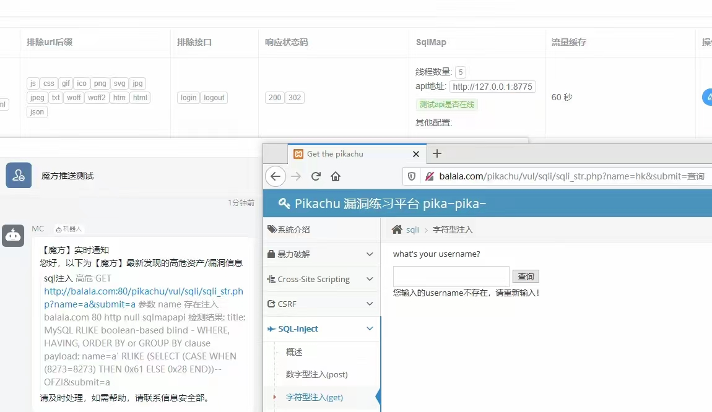
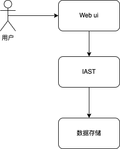
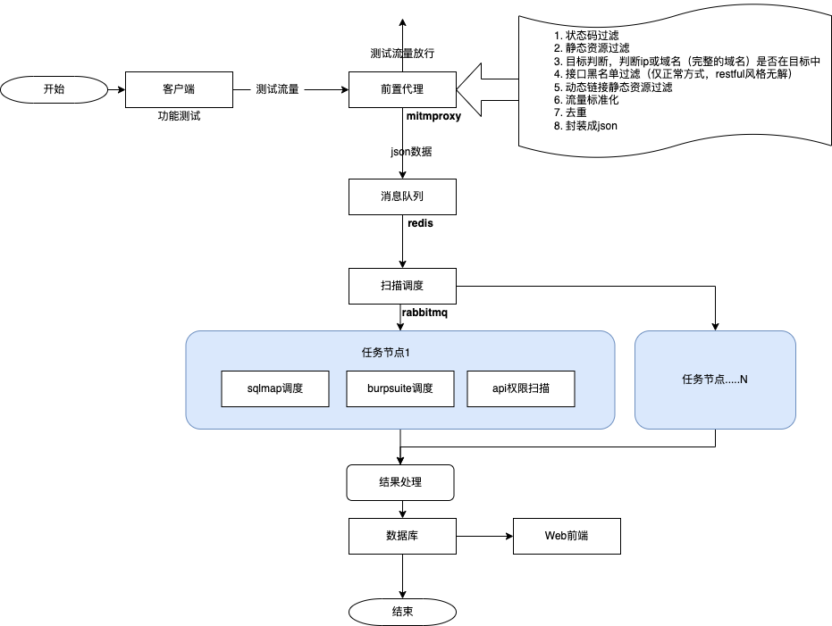

## 巧用 IAST摸鱼

> 基于代理式的交互式应用安全测试

> 如何用喝一杯奶茶的时间，测完整个Web系统。

本文不会介绍 IAST 的概念之类，有需要可自行查询，谨以个人实践应用出发，分享一点点经验。

## 引言

安全测试，基本都是在上线前才介入，这时就可能会有这样的局面，安全发现了利用难度较低、风险很高但很难修复的漏洞，对于项目方而言，修复会使项目延期上线，对于安全而言，不修复就不给上线；于是在权衡之后，可能采取了折中的方式去做限制但没有完全修复，于是特批带着漏洞的项目上线。当然，现实中不太可能存在带着高风险漏洞上线，中低风险漏洞带上生产环境还是有可能的。

对于安全测试人员而言，趁手的工具/系统尤为重要，如被动扫描工具、burpsuite、sqlmap等。以burpsuite为例，流程通常是：代理->修改数据/扫描重放->验证结果->修复闭环，展开讲就是：

1. 启动burpsuite，配置浏览器代理；
2. 获取流量进行修改，重放扫描Web漏洞，修改数据包，检测越权，未授权访问，其他非扫描型Web漏洞。
3. 结果验证；输出报告；复测闭环。

基本就是在项目上线前重复上述操作。

那有没有办法能够简化这样的流程，或者是如何让安全测试适应SDLC，DevOps？

如果将安全测试嵌入DevOps，在项目不断迭代过程中，安全测试就会显得较为乏力，疲于应对各个版本，各种漏洞验证之类，投入产出不成正比，久而久之，还不如一开始的，只在上线前做安全测试。有没有一种可能，让项目QA甚至是项目开发来提前进行安全测试，从而让绝大部分漏洞都在DevOps前阶段闭环，以减少后续安全测试的人力投入。

## 架构

代理式IAST的demo其实早在20年底已经验证过了（基于sqlmapapi）

浏览器配置IAST的代理，IAST会自动扫描通过代理的流量（调用sqlmapapi扫描sql注入），同时处理漏洞，很简单就画出了架构图：

谁还不知道用户通过Webui操作IAST，然后前端查看数据....稍微给架构图加点细节，就能画出流程图了：

在流程图中给出了用到的技术架构，代理使用mitmproxy，数据缓存使用redis，消息队列使用rabbitmq。

图有了，系统也就不远了。

## 一点点收益

1. 在不改变安全测试的习惯下，提高了测试效率，只需在浏览器/手机配置IAST的代理，产生流量后，由IAST扫描处理结果，再到前端查看，导出报告，分享漏洞结果即可。
2. 安全测试100%覆盖接口及Web漏洞，同时能够自动化测试未授权访问，水平越权，垂直越权，dnslog相关（如log4j）漏洞。
3. 如果有自动化测试脚本，配合IAST，能够快速迭代情况下，对接口进行自动化安全测试。
4. 无需安全团队参与，QA及开发人员也能够自行进行安全测试。

## 题外话

接触过很多IAST，插桩式的；严格划分测试网段，从网络设备获取流量来测试的；在反向代理如nginx上安装模块来获取流量的。为什么用代理式的，不用插桩的或者其它？基于代理式的有很强的通用性，任何Web系统/接口，都能通过代理方式来获取流量；不改变安全测试人员的习惯；非安全人员也能从容进行安全测试；不对目标系统有任何侵入。但也有比较明显的缺点，有脏数据，无法测试防重放的请求等。但对于DevOps流程及安全团队来说，也是可以值得思考的方向。

本文并没有详细说明IAST的全部流程，也没有说明需要注意的坑，后续应该会有系列文章，对现有的IAST进行详细讲解。